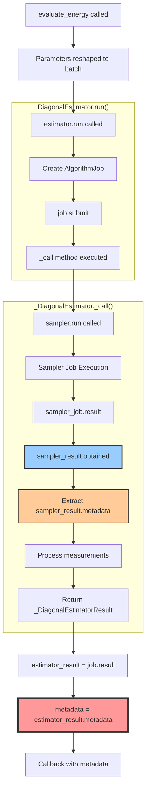
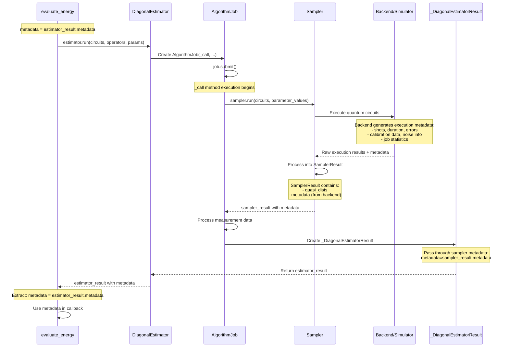
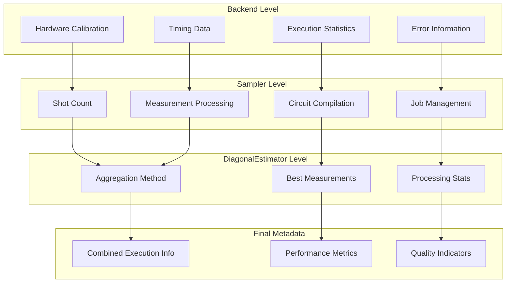
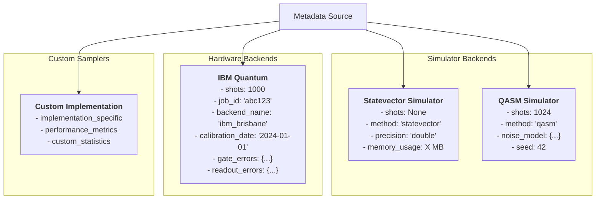
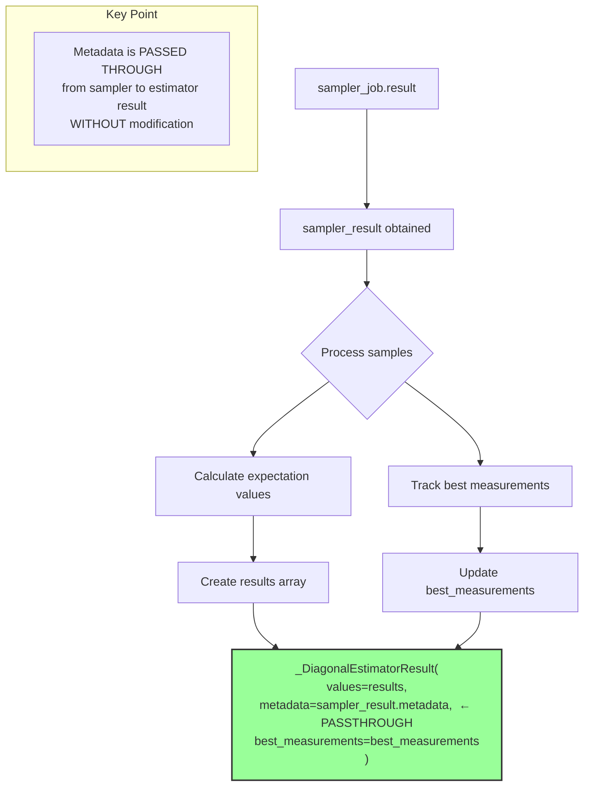
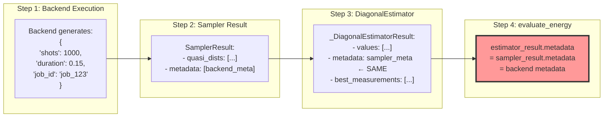

# Metadata Calculation Flow in SamplingVQE

## Main Metadata Flow Diagram

## Detailed Metadata Generation Process

## Metadata Content Structure

## Code Trace: Metadata Calculation Points

```mermaid
flowchart LR
    subgraph "1. Sampler Execution"
        A["`sampler.run()
        Creates job with circuits`"]
        B["`Backend executes
        Generates metadata`"]
        C["`sampler_result.metadata
        Contains execution info`"]
    end
    
    subgraph "2. DiagonalEstimator Processing"
        D["`_call method
        Gets sampler_result`"]
        E["`Extract metadata:
        sampler_result.metadata`"]
        F["`Pass to result:
        metadata=metadata`"]
    end
    
    subgraph "3. Algorithm Level"
        G["`estimator_result
        Contains metadata`"]
        H["`Line: metadata = 
        estimator_result.metadata`"]
        I["`Callback receives
        metadata`"]
    end
    
    A --> B --> C
    C --> D --> E --> F
    F --> G --> H --> I
    
    style H fill:#ff6666,stroke:#333,stroke-width:3px
```

## Metadata Types by Backend

## Metadata Processing in _DiagonalEstimator

## Example Metadata Flow

## Key Insights

1. **Passthrough Nature**: Metadata flows through without modification from backend → sampler → estimator → algorithm
2. **Backend Origin**: The actual metadata content is generated at the backend/hardware level
3. **Per-Circuit**: Each circuit execution gets its own metadata entry
4. **Rich Information**: Contains execution context, performance metrics, and quality indicators
5. **Debug Value**: Essential for monitoring algorithm performance and troubleshooting issues